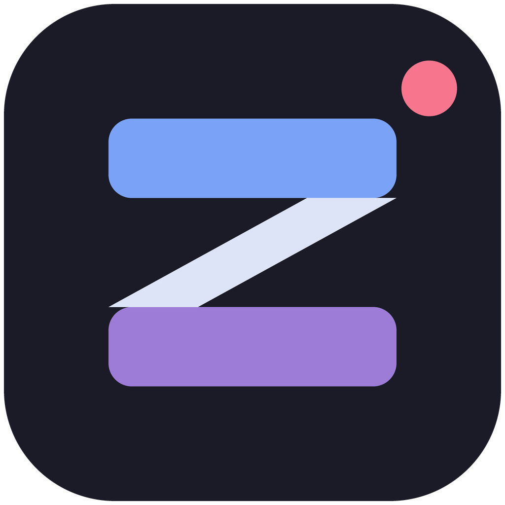
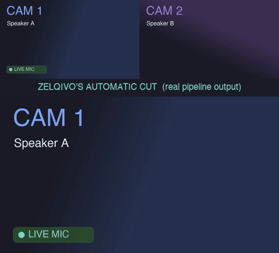
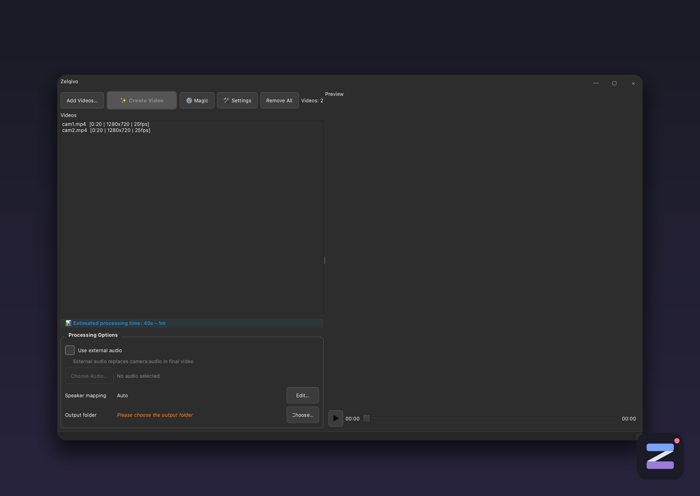

<div align="center">



# Zelqivo

**Automatic multicam editing for podcasts and interviews.**
Point it at your camera files — get back a cut video.

[](https://github.com/roman-berlin/Zelqivo-Video-Program/actions/workflows/ci.yml)


-lightgrey)
[](https://github.com/roman-berlin/Zelqivo-Video-Program/labels/good%20first%20issue)

</div>

<div align="center">



<sub>Real pipeline output. The green mic shows who is speaking on each camera —
the bottom view is the cut Zelqivo produced automatically (rule-based switching
with a stability window, which is why cuts land ~0.4s after a speaker change).
Synthetic test cameras for now; a real-footage demo is coming.</sub>

</div>

You recorded a podcast with two or three cameras. Now someone has to sit in an
editor and cut to whoever is talking, for the whole episode. Zelqivo does that
part for you: it detects who is speaking and builds the camera cuts
automatically.

## What it does

- **Automatic speaker cuts** — analyses the audio, detects the active speaker,
  and switches cameras with sensible pacing (minimum shot length, switch
  cooldown, cuts on silences).
- **Audio sync** — aligns your camera files to each other (and to an external
  recorder track if you have one).
- **Renders a finished MP4** — or exports the cut as **FCPXML**, so you can
  keep polishing in Final Cut Pro / Premiere / DaVinci instead of starting
  from zero.
- **Runs on your machine** — no upload, no account, no cloud. A CPU-only mode
  works everywhere; an optional AI mode improves speaker detection.
- **QA overlay & artifacts** — optional debug view showing *why* it cut where
  it cut.

<div align="center">

</div>

## What it doesn't do (yet)

We keep an honest feature list in [docs/FEATURE_REALITY.md](docs/FEATURE_REALITY.md)
and an ordered [roadmap](docs/ROADMAP.md). Headlines: no timeline editing, no
trim UI, no multiview grid — today Zelqivo is an *automatic* editor, not a
manual one. There is no installer download yet (coming with signed releases);
for now you run it from source, below.

## How it works

```
probe files → sync audio → detect active speaker → rule-based cuts → render / FCPXML
```

## Platform support

| Platform | Status |
|---|---|
| Windows 10/11 | Primary target; installer build script included |
| macOS | Runs from source; first-class support (menu bar, .dmg) is [in progress](docs/ROADMAP.md) |
| Linux | Runs from source; community-supported |

## Install and run (from source)

You need Python 3.10–3.12 and [FFmpeg](https://ffmpeg.org/download.html) on
your PATH.

```bash
git clone https://github.com/roman-berlin/Zelqivo-Video-Program.git
cd Zelqivo-Video-Program
python -m venv .venv
source .venv/bin/activate        # Windows: .venv\Scripts\activate
pip install -e .
python -m multicam_editor
```

That's the CPU-only mode with energy-based speaker detection — works on any
machine. To check what's available in your install:

```bash
python -m multicam_editor.utils.backends
```

### Optional: AI speaker detection

```bash
pip install -e ".[ai]"
```

This adds real diarization via `pyannote.audio` (~2 GB of models, needs a free
Hugging Face account):

1. Create an account at https://huggingface.co/join
2. Accept the model terms at https://hf.co/pyannote/speaker-diarization-3.1
3. Create a **Read** token at https://hf.co/settings/tokens, then run
   `hf auth login` and paste it

Models download to `~/.cache/huggingface/hub/` on first use and are cached
after that.

## Headless CLI

For scripting and QA there is a no-GUI entry point:

```bash
python -m multicam_editor.cli \
  --videos cam1.mp4 cam2.mp4 \
  --external-audio podcast.wav \
  --preset 1080p \
  --out output.mp4 \
  --export-artifacts true
```

| Argument | Required | Default | Description |
|---|---|---|---|
| `--videos` | Yes | – | Input video files (at least 2) |
| `--external-audio` | No | – | External audio file to sync |
| `--enable-speaker-switching` | No | true | Speaker-based camera switching |
| `--preset` | No | 1080p | Output resolution: 1080p, 720p, 480p |
| `--export-artifacts` | No | false | Write QA artifacts (cut plan, diarization JSON) |
| `--verbose` / `-v` | No | false | Verbose logging |

Exit code 0 = success. With `--export-artifacts true` the CLI prints a folder
containing `cut_plan.json`, `diarization.json`, and `processing_summary.json`.

**Log files** (attach these to bug reports):
- Windows: `%LOCALAPPDATA%\Zelqivo\logs\zelqivo.log`
- macOS and Linux: `~/.zelqivo/logs/zelqivo.log`

Logs rotate automatically (5 files × 1 MB max).

If something breaks, the fastest way to get help is **Settings → Export Debug
Package** in the app, then open an issue with the ZIP attached.

## Building the Windows installer

```powershell
.\build_exe.ps1
```

Builds a standalone EXE with PyInstaller (spec: `multicam_editor.spec`), then
an Inno Setup installer (`Installer/setup1.iss`). The script currently expects
FFmpeg binaries at `C:\ffmpeg-7.1.1-full_build\bin\` — making this
configurable (and switching to an LGPL FFmpeg build) is the current top
roadmap item; see [docs/planning/PHASE_0_2_PLAN.md](docs/planning/PHASE_0_2_PLAN.md).

After building, smoke-test: launch the EXE → add 2 videos → preview & seek →
export → play the MP4.

## Contributing

Bug fixes, tests, docs, and platform work are all welcome — this project is
young and the easy wins are mapped out:

- [CONTRIBUTING.md](CONTRIBUTING.md) — setup, tests, style, what gets merged
- [docs/GOOD_FIRST_ISSUES.md](docs/GOOD_FIRST_ISSUES.md) — 10 evening-sized
  starter tasks, each one already open as a
  [`good first issue`](https://github.com/roman-berlin/Zelqivo-Video-Program/labels/good%20first%20issue)
- [docs/ARCHITECTURE.md](docs/ARCHITECTURE.md) — how the pieces fit together

Current test baseline: **539 passed** (Qt tests included). CI is on the
roadmap and not yet set up — honesty over badges.

## License

The source code is licensed under the **Apache License 2.0** — see
[LICENSE](LICENSE) and [NOTICE](NOTICE). Third-party components and their
licenses are listed in [docs/THIRD_PARTY.md](docs/THIRD_PARTY.md).

The "Zelqivo" name and logo are trademarks and are **not** covered by the code
license — see [TRADEMARK.md](TRADEMARK.md).

Plainly, so there are no surprises: the desktop app in this repo is free and
open source, forever. A paid, closed-source Pro tier (cloud features for
studios) is planned as a separate product by the same author — the Apache
license makes that split legal and explicit.
